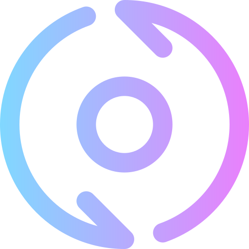

<h1 align="center">



<br>
<br>

Notion Board

</h1>

## Introduction 
This action lets you sync your GitHub issue with your notion board. Currently it syncs issue state and labels. 

> More feature on the way.

## Inputs

|input|description|required|
|-----|-----------|--------|
|`NOTION_API_KEY`|your notion api key|`true`|
|`NOTION_DATABASE`|your notion database id|`true`|
|`GITHUB_TOKEN`|your github token|`true`|

## Usage
```yml
name: Notion Board
on:
  issues:
  issue_comment:
jobs:
  notion:
    runs-on: ubuntu-latest
    steps:
      - uses: actions/checkout@v2
      - name: Notion Board
        uses: Souvikns/Notion-Board@v1.0.0
        env: 
          GITHUB_TOKEN: ${{ secrets.GITHUB_TOKEN }}
          NOTION_API_KEY: ${{ secrets.NOTION_API_KEY }}
          NOTION_DATABASE: ${{ secrets.NOTION_DATABASE }}
```