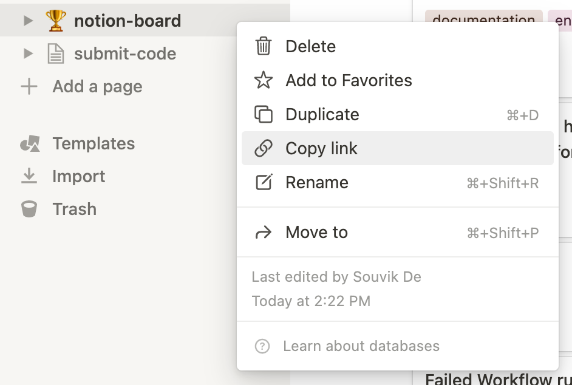

<h1>
 Notion Board
</h1>

**Notion-Board** brings Notion and GitHub closer than before. Notion-board lets you sync your GitHub Issues with notion database, so whenever a new issue is opened or existing issue is updated in GitHub it syncs your notion database accordingly. 

> Currently **Notion-Board** syncs issue title, lables and state. In future we are going to support more features so stay tuned. 

You can try it out by opening a new issue in this repository and see it get synced in this [Notion Database](https://souvikns.notion.site/64bc98b98e6242c9bbc1cbedf9c93261?v=621cc0ced4614c56831a21f8cf974674). 

## Table of Contents 
- [Setup Guide](#setup-guide)
  - [Setting up GitHub workflow](#setting-up-github-workflow)
  - [Adding `env` Variables](#adding-env-variables)
  - [Setting up Notion Database Properties](#setting-up-notion-database-properties)
  - [Sync Your Existing Issues](#sync-your-existing-issues)
- [Notion Template](#notion-template)
- [Reporting Issues](#reporting-issues)
- [Contributing](#contributing-guide)
  - [Contributing Guide](#contributing-guide)
    - [Getting Started Quick](#getting-started-quick)
- [Community Support](#community-support)
- [License](#license)


## Setup Guide
To use **Notion-Board** you need to write a GitHub workflow and setup some unique properties in your notion database as well. In this guide we are going to help you setup Notion-board and get started. 

### Setting up GitHub workflow
Create a file `notion.yaml` in the foler `.github/workflows` and add these lines - 

```yaml
name: Notion Board
on:
  issues:
  issue_comment:
  workflow_dispatch:
    inputs:
      setup:
        description: 'Populate your notion database with all the requried properties'
        type: boolean
      syncIssues:
        description: 'sync all other existing issues in this repo'
        type: boolean
jobs:
  build:
    runs-on: ubuntu-latest
    steps:
      - uses: actions/checkout@v2
      - name: Notion Board
        uses: Souvikns/Notion-Board@2.1.0
        with:
          setup: ${{github.event.inputs.setup}}
          syncIssues: ${{github.event.inputs.syncIssues}}
        env: 
          GITHUB_TOKEN: ${{ secrets.GITHUB_TOKEN }}
          NOTION_API_KEY: ${{ secrets.NOTION_API_KEY }}
          NOTION_DATABASE: ${{ secrets.NOTION_DATABASE }}
```

### Adding `env` Variables

Now you need to setup some `env` vairables for the workflow to run properly - 

|variable name | Description| Requried |
|--------------|------------|----------|
|`GITHUB_TOKEN`|Github workflow token, this is added by default| `true`|
|`NOTION_API_KEY`| Notion Integration token|`true`|
|`NOTION_DATABASE`| Notion Daatabase ID| `true`|

- To learn how to add cusotom env variables follow [this blog](https://damienaicheh.github.io/github/actions/2021/04/15/environment-variables-secrets-github-actions-en.html).

- To learn how you can create a new `notion integration api key` you can follow [this](https://developers.notion.com/docs/getting-started) step by step guide from Notion.

- You can grab your notion `database id` from the url
```
https://www.notion.so/myworkspace/a8aec43384f447ed84390e8e42c2e089?v=...
                                  |--------- Database ID --------|
```

- To get the url you can right click on the database name from the side bar and copy the link



### Setting up Notion Database Properties 
Now that you have successfully completed setting up GitHub side of things you have to add some requried [notion properties](https://www.notion.so/help/guides/database-properties-help-organize-your-teams-information) for **Notion-Board** to run properly. 

**Notion Properties** 
|Property| Type|
|--------|-----|
|State| `Select`|
|URL| `url`|
|Label| `multi-select`|
|ID| `number`|

You can also use the notion `workflow_dispatch` to automatically setup your notion database
**Steps**
- Just head over to the `actions` tab and go to `Notion Board` workflow
- click the `Run workflow` button and select the first option that you see. 

- This will create the requried properties in your notion database. 

### Sync Your Existing Issues
If you are adding **Notion-Board** to project that already has some existing issue, you have to set them up manually. All you have to do is run the `workflow` with `sync all other existing issues in this repo` checked. 


---

## Notion Template
> I hope to make a list of different useful notion templates for you to pick from, you can even submit the one you are using by opening a new Issue. 

Here is a simple barebones [Notion Template](https://souvikns.notion.site/64bc98b98e6242c9bbc1cbedf9c93261?v=621cc0ced4614c56831a21f8cf974674) that you can duplicate to quickly get started. You can also share your notion template that you are using by opening a new issue and we can create a notion template library right here. 

**Notion Templates**
- [Minimal](https://souvikns.notion.site/64bc98b98e6242c9bbc1cbedf9c93261?v=621cc0ced4614c56831a21f8cf974674)
- More coming soon...

## Reporting Issues
Currently **Notion-Board** is under development and it has a lot of bugs that we are fixing as they come up. Feel free to let us know if you find and bug, it would help the tool get better. I report a bug just open a [Issue](https://github.com/Souvikns/Notion-Board/issues) describing the bug. 

## Contributing
Please take a moment to read our [contributing guide](#contributing-guide) to learn about our development process. I would suggest to open an [issue](https://github.com/Souvikns/Notion-Board/issues) first to discuss potential changes/addition.

### Contributing Guide
This project is build using [typescript](https://www.typescriptlang.org/) so you need to have [nodeJS](https://nodejs.org/en/) installed in your system. You can download nodeJS from [here](https://nodejs.org/en/download/). 

#### Getting Started Quick 
In order to contribute to this project, you should:

1. Clone this repository from your fork 
2. Run `npm install` in the project directory to install all the requried dependencies. (You have to have npm on your system, if you have nodejs you most probably have npm installed as well)
3. Create a new branch with a meaningful name. 
4. Develop a new feature or fix a bug you want. 
5. Open a pull request to the `main` branch
  - Remember to build and package the code before you commit run -
    - `npm run build` 
    - `npm run package` 


## Community Support 
Currently [I](https://github.com/Souvikns/) am the sole maintainer of the project, you can star this project to follow it's development. Feel free to open issues for any new feature that you want, and I will try to build it. Feel free to fork the project and build the feature for yourself if I am too slow. 


## License
This software is licensed under Apache-2.0, see the [LICENSE](./LICENSE) file for more information. 
