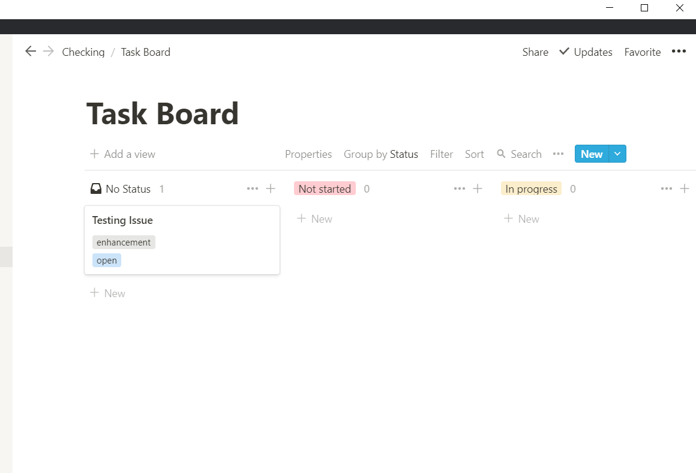

<h1 align="center">


<br>
<br>

Notion Board

</h1>

## Table of contents
- [Introduction](#introduction)
- [Inputs](#inputs)
- [Usage](#usage)
- [Set up Notion Board](#set-up-notion-board)
- [Screenshot](#screenshot)

## Introduction 
This action lets you sync your GitHub issue with your notion board. Currently it syncs issue title, body, state and labels. 

> More features on the way.

## Inputs

|input|description|required|
|-----|-----------|--------|
|`NOTION_API_KEY`|your notion api key|`true`|
|`NOTION_DATABASE`|your notion database id|`true`|
|`GITHUB_TOKEN`|your github token|`true`| (automatically created)

## Usage
```yml
name: Notion Board
on:
  issues:
  issue_comment:
  workflow_dispatch:
jobs:
  notion:
    runs-on: ubuntu-latest
    steps:
      - uses: actions/checkout@v2
      - name: Notion Board
        uses: Souvikns/Notion-Board@latest
        env: 
          GITHUB_TOKEN: ${{ secrets.GITHUB_TOKEN }}
          NOTION_API_KEY: ${{ secrets.NOTION_API_KEY }}
          NOTION_DATABASE: ${{ secrets.NOTION_DATABASE }}
```

Start with [setting up an integration and sharing your Notion database](https://developers.notion.com/docs/getting-started) with the integration.

After setting up your workflow, add your `NOTION_API_KEY` and `NOTION_DATABASE` secrets to your repository.

> 🚩🚩 With the update of [Notion_API](https://developers.notion.com/reference/intro) now you don't have to add **database propoerties**. 

## Set up Notion Board

Now **Notion Board** uses `workflow_dispatch` to automatically setup your Notion Database creating all the necessary database properties. 

<details>
<summary>🚀 <b>Manually trigger the action to complete setup</b>.</summary>
<br>

</details>


## Screenshot

